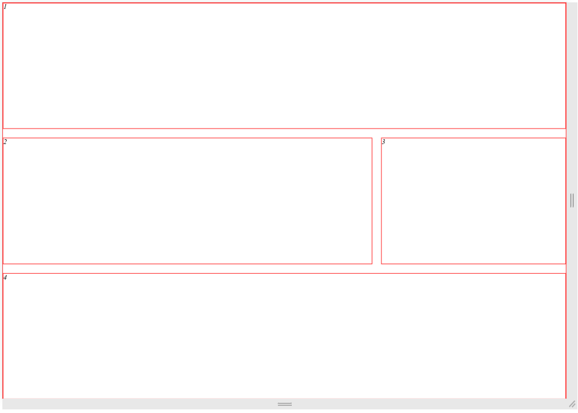

# Propriedades Fundamentais

Existem muitas propriedades, porém algumas já serão vistas por nós no curso. Não é necessário entender tudo a fundo no primeiro momento, mas é essencial que se faça entender do básico, dos fundamentos.

## Fundamentos

Todo Grid é composto de 2 principais grupos: `container -> pai` e `itens -> filhos`.

O container pai é quem contém os elementos, os itens. E oque isso significa em código?

```html
<div id="app">
  <header></header>
  <main></main>
  <aside></aside>
  <footer></footer>
</div>
```

Ou seja, o container pai é a div com id "app", uma vez que contém em si todos os elementos que serão mostrados em forma de Grid. Logo, todos os elementos html dentro dele são itens, são os filhos.

Todo container pai precisa ter a seguinte propriedade para se comportar como Grid:

```css
#app {
  display: grid;
}
```

A primeira coisa a ser notada no layout é que todos os elementos, os itens, os filhos, são posicionados em um esquema de linhas, de _rows_. De fato pode-se reconhecer que são alteradas as propriedades de comportamento dos filhos, dos itens do Grid.

Além disso, onde devemos também colocar muito a nossa atenção é com a propriedade `grid-template`, que é o shorthand de outras três propriedades:

- `grid-template-columns`;
- `grid-template-rows` e;
- `grid-template-areas`.

Se trata da versão curta das propriedades que definem, respectivamente, a forma das colunas, a forma das linhas e as formas das áreas do Grid.

Um exemplo simples para tal é definir da seguinte forma:

```css
#app {
  display: grid;
  grid-template-columns: 100px 200px 300px 400px;
  /* Ou até, em vez de usar px, usar algo como: 1fr 2fr 3fr 4fr */
  /* Ou ainda como: repeat(4, 1fr) */
}
```

Os resultados disso são mudanças no layout dos elementos contidos dentro do pai, os itens, para se adequar a quantidade de colunas definidas por linha e tamanho.

Agora, sobre a parte de rows, que funciona da mesma maneira, porém de forma horizontal.

### Itens

Agora que entendemos o básico da utilização dos templates da propriedade Grid, iremos ver o que podemos utilizar nos itens para posicioná-los em relação ao template que fizemos.

As propriedades essenciais são essas:

- `grid-column`:
  - `grid-column-start`;
  - `gird-column-end`.
- `grid-row`:
  - `grid-row-start`;
  - `grid-row-end`.
- `grid-area`.

Basicamente informamos ao navegador, que está processando os estilos, onde queremos, em relação à coluna e linha, que nosso item fique, de onde até onde ele irá.

Podemos então utilizar em conjunto com o `grid-template-areas`, no container pai, o `grid-areas`, nos filhos. Assuma a seguinte estrutura HTML e o respectivo CSS:

```html
<!DOCTYPE html>
<html lang="pt-br">
  <head>
    <meta charset="UTF-8" />
    <meta name="viewport" content="width=device-width, initial-scale=1.0" />
    <title>Fundamentos do Grid</title>
    <link rel="stylesheet" href="style.css" />
  </head>
  <body>
    <div id="app">
      <header>1</header>
      <main>2</main>
      <aside>3</aside>
      <footer>4</footer>
    </div>
  </body>
</html>
```

```css
* {
  margin: 0;
  padding: 0;
  box-sizing: border-box;
}

*:not(#app, body) {
  border: 1px solid red;
}

#app {
  display: grid;
  grid-template:
    "header header header"
    "main main aside"
    "footer footer footer";
  gap: 20px;
}

#app header {
  grid-area: header;
}

#app main {
  grid-area: main;
}

#app footer {
  grid-area: footer;
}
```

Assim teriamos o seguinte resultado:



### Propriedades de alinhamento

Existem 9 propriedades de alinhamento fundamentais:

Aplicadas em Containers (pai):

- `align-content`;
- `justify-content`;
- `place-content`;

- `align-items`;
- `justify-items`;
- `place-items`.

Aplicadas em itens (filho):

- `align-self`;
- `justify-self`;
- `place-self`.

E então podemos separar em três grupos: `align` (eixo _y_, vertical), `justify` (eixo _x_, horizontal) e `place` (_ambos_ os eixos, vertical e horizontal).

Dessa forma, deve-se destacar que cada um deles vai, respectivamente, observar o:

- Conteúdo do elemento `content` (todas as caixas de conteúdo);
- Items do elemento `items` (os elementos dentro das caixas de conteúdo);
- O próprio elemento `self` (o próprio elemento).

### Propriedades Auto

Temos três:

- `grid-auto-flow` (para definir se o fluxo será em rows ou columns);
- `grid-auto-rows` (para definir os tamanhos de cada row);
- `grid-auto-columns` (para definir os tamanhos de cada column).

São raramente usadas, com destaque de uso para a primeira.

## Grid ou Flex

Qual devemos utilizar? _Aquele que dominamos mais, o que resolverá nosso problema_.

A esta altura já podemos notar que chegamos nos "mesmos" resultados utilizando técnicas diferentes e devemos sempre optar para aquilo que parece se encaixar mais em nosso contexto.

Contexto este que, dada a aplicação que será desenvolvida, é relativo ao que você domina melhor e a simplicidade que será adotada para a construção do layout.
