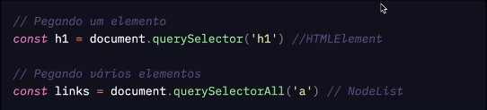
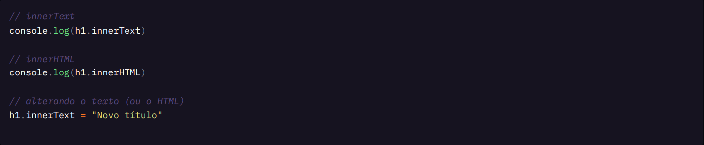
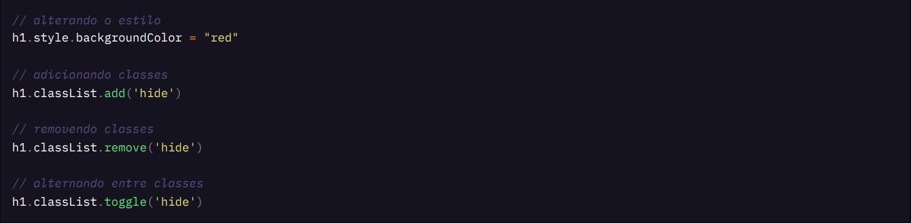

# O que é a DOM?

- Document Object Model:
  - modelagem do documento como objeto JavaScript.
- Representação do HTML em objetos JavaScript:
  - atributos (propriedades) e métodos (funcionalidades).
- Criado pelo navegador (browser):
  - é uma interface (API) usada no navegador.

> Mas o que é uma interface (API)? Se trata do termo abreviado em inglês para Application Programming Interface, ou seja: um conjunto de serviços/funções que foram implementadas em um programa de computador que são disponibilizados para que outros programas/aplicativos possam utiliza-los diretamente de forma simplificada.

Para fazermos o JS conversar/manipular o HTML precisamos fazer uso da DOM.

## Para que serve?

O JS usará essa API para:

- Se conectar ao HTML:
  - a DOM não é o JavaScript.
- Manipular o HTML com JS:
  - modificar o HTML, suas tags e conteúdos, estilos e até disparar ações.

## Dev Tools

Através das ferramentas do desenvolvedor, `Dev Tools`, do seu navegador podemos observar e interagir com a DOM.

Temos dois objetos principais na DOM:

- `window`: objeto global presente em qualquer página no navegador;
  - Funções como `alert()` e `prompt()` estão presentes aqui.
- `document`: a representação em objeto JS do documento HTML.
  - Funções como `querySelector()`, `createElement()` e outras mais, estão presentes aqui.

## Manipulação da DOM

Sim, podemos manipular elementos da DOM (do nosso HTML e, inclusive, CSS).

Isso se dá a partir do entendimento de conceitos abordados anteriormente na anotação e alguns que vamos expandir agora, conceitualmente e na prática por meio da solução do jogo da adivinhação.

### Element e Node

As tags HTML, quando usadas pela DOM, podem ser chamadas de `node` (nó) ou `element` (elemento):

Por mais que se trate de uma exemplificação simplista e não evidencie uma necessidade de busca imediata e aprofundada sobre os termos, podemos entender o seguinte:

- `elements`: representa um elemento, uma tag HTML, presente no documento HTML, fazendo uso da DOM (os objetos do nosso documento traduzidos em objetos JS) para pegar exatamente uma única tag, por exemplo, por meio do uso do método `querySelector` do objeto `document`;
- `node`: representa um grupo de elementos, varias tags HTML, presentes no documento HTML, fazendo uso da DOM para pegar exatamente um grupo de tags, por exemplo, por meio do uso do método `querySelectorAll`, também do objeto `document`.

Ou seja: o `node` é o agrupamento de `elements`, logo, se trata de um aglomerado selecionado por nós de elementos de uma "mesma" natureza, frutos de um mesm seletor, seja ele uma tag `a` (para links), `h1`, `h2`, etc., para headings e outros exemplos mais.

### Recebendo e modificando valores

Podemos pegar qualquer valor das tags dos `elements` encontrados e, também, alterá-los:

#### Alterando estilos

Podemos alterar estilos ou adicionar classes em elementos:

## Eventos

A DOM é direcionada a eventos, isso é conhecido como `Event-driven`. Significa que ela poderá agir a qualquer tipo de evento relacionado à página.

Podemos compreender o conceito em duas fases:

- A ocorrência do evento e;
- A reação à ocorrência.

Mas o que são eventos propriamente ditos? _São ações que acontecem na página, site ou aplicação_ e isso se caracteriza por meio da síntese da seguinte lista de eventos:

- Carregamento do documento, a aparição de elementos na tela;
- Modificação das propriedades da página (largura, altura, scroll, etc.);
- Cliques de mouse e digitação no teclado;
- Interação com sons, imagens, vídeos, etc.;
- Entre muitos outros.

### Reações

O sistema poderá executar reações às ações. Executar uma função sempre que determinada ação acontecer.

Um exemplo:

Ao clicar em um botão, apresenta em tela um elemento que antes estava escondido pela propriedade de estilo `display: none;`:

