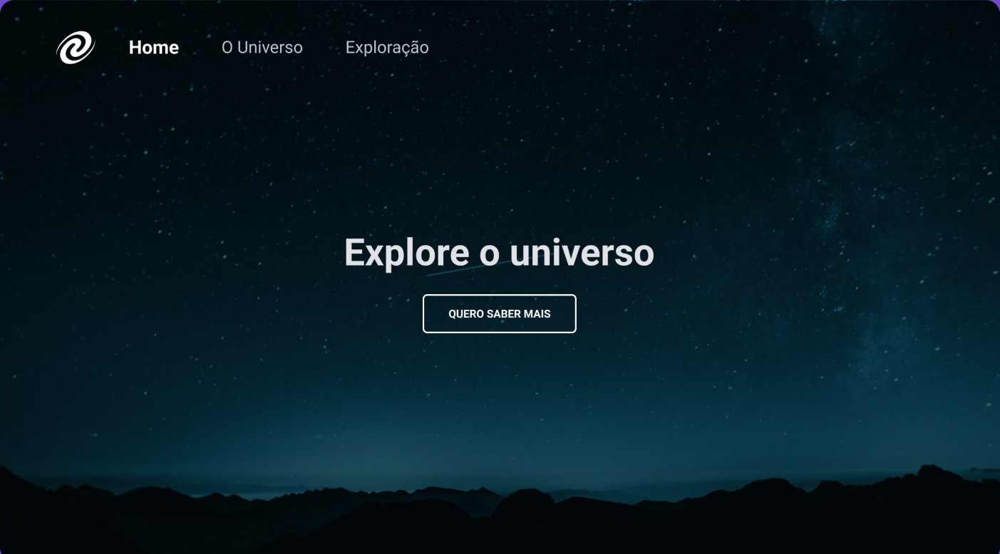

<h1 align="center">SPA Universe</h1>

<p align="center">
  
  
  
  
</p>



## Sobre o projeto

Possui finalidade de estudo; É um dos desafios da RocketSeat, o primeiro que une todos os conceitos de HTML, CSS, JS e o básico de Node (somente npm e scripts) para criar um servidor de desenvolvimento mais próximo da realidade.

### Como testar o projeto

Primeiro, clone o projeto e acesse a pasta onde se encontram os arquivos da aplicação.

Após isso, faça os seguintes comandos:

```shell
# Para instalar as dependências do projeto
npm install

# Para rodar a aplicação em ambiente de desenvolvimento
npm run dev
```

## Licença

Distribuído sobre a licença MIT. Veja **[LICENSE.md](./LICENSE.md)** para mais informações.

## Meta

Meus links:

- [Gmail](mailto:dev.eddyyxxyy@gmail.com?)
- [Github](https://github.com/eddyyxxyy)
- [LinkedIn](https://www.linkedin.com/in/eeddyyxxyy/)
- [Youtube](https://www.youtube.com/channel/UCIISJihJOYOBj-4oZhW3pSw)
